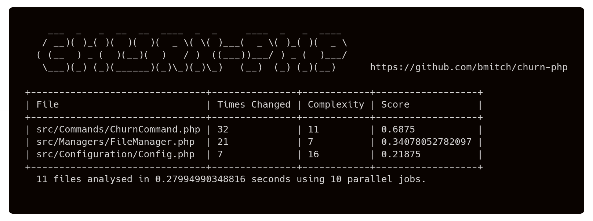

# churn-php
Helps discover good candidates for refactoring.

[](https://github.com/bmitch/churn-php/actions)
[](https://codecov.io/gh/bmitch/churn-php)
[](https://scrutinizer-ci.com/g/bmitch/churn-php/?branch=master)
[](https://codeclimate.com/github/bmitch/churn-php)
[](https://packagist.org/packages/bmitch/churn-php)
[](https://packagist.org/packages/bmitch/churn-php/stats)
[](LICENSE.md)
[](https://paypal.me/bmitch2112)
----------

## Table of Contents
* [What Is it?](#what-is-it)
* [Compatibility](#compatibility)
* [How to Install?](#how-to-install)
* [How to Use?](#how-to-use)
* [How to Configure?](#how-to-configure)
* [Similar Packages](#similar-packages)
* [Contact](#contact)
* [Contributing](#contributing)
* [License](#license)

## What is it?
`churn-php` is a package that helps you identify php files in your project that could be good candidates for refactoring. It examines each PHP file in the path it is provided and:
* Checks how many commits it has.
* Calculates the cyclomatic complexity.
* Creates a score based on these two values.

The results are displayed in a table:



A file that changes a lot and has a high complexity might be a better candidate for refactoring than a file that doesn't change a lot and has a low complexity.

`churn-php` only assists the developer to identify files for refactoring. It's best to use the results in addition to your own judgment to decide which files you may want to refactor.

## Compatibility
* PHP 7.1+

If you want to install `churn-php` in Symfony project, your Symfony components version must be 3.4 or higher.

## How to Install?
Install via Composer:
```
composer require bmitch/churn-php --dev
```

You can also install `churn-php` with [Phive](https://phar.io/):
```
phive install churn
```

## How to Use?
```
vendor/bin/churn run <one or more paths to source code> ...
vendor/bin/churn run src
vendor/bin/churn run src tests
```

You can also use `churn-php` via [Docker](https://hub.docker.com/r/dockerizedphp/churn):

```
docker run --rm -ti -v $PWD:/app dockerizedphp/churn run src
```

## How to Configure?
You may add an optional `churn.yml` file which can be used to configure churn-php. The location of the churn.yml file can be customized using these commands:

```
Default: "churn.yml" 
vendor/bin/churn run -c <path>
vendor/bin/churn run --configuration[=CONFIGURATION] <path>
```
A sample `churn.yml` file looks like:

```yml
# The maximum number of files to display in the results table.
# Default: 10
filesToShow: 10

# The minimum score a file need to display in the results table.
# Disabled if null.
# Default: 0.1
minScoreToShow: 0

# The number of parallel jobs to use when processing files.
# Default: 10
parallelJobs: 10

# How far back in the VCS history to count the number of commits to a file
# Can be a human readable date like 'One week ago' or a date like '2017-07-12'
# Default: '10 Years ago'
commitsSince: One year ago

# Files to ignore when processing. The full path to the file relative to the root of your project is required.
# Also supports regular expressions.
# Default: All PHP files in the path provided to churn-php are processed.
filesToIgnore:
 - src/Commands/ChurnCommand.php
 - src/Results/ResultsParser.php
 - src/Foo/Ba*

# File extensions to use when processing.
# Default: php
fileExtensions:
 - php
 - inc

# The version control system used for your project.
# Accepted values: fossil, git, mercurial, none
# Default: git
 vcs: git
 ```

If a `churn.yml` file is omitted or an individual setting is omitted the default values above will be used.

### Output formats

You can configure `churn` to output the result in different formats. The available formats are:

* `csv`
* `json`
* `text` (default)

To use a different format use `--format` option. Example command for `json`: 

```bash
vendor/bin/churn run --format json
```

## Similar Packages
* https://github.com/danmayer/churn (Ruby)
* https://github.com/chad/turbulence (Ruby)

## Contact
Questions, comments, feedback? [@bmitch2112](https://twitter.com/bmitch2112)

## Contributing
* Please run `composer test` on PHP 7.1 and ensure it passes.
* If you don't have access to PHP 7.1 please make sure that CI build passes when you make pull request. If you are unable to get it to pass in the pull request please ping me and I can help.
* Please see [CONTRIBUTING.md](CONTRIBUTING.md)

## License
The MIT License (MIT). Please see [License File](LICENSE.md) for more information.
